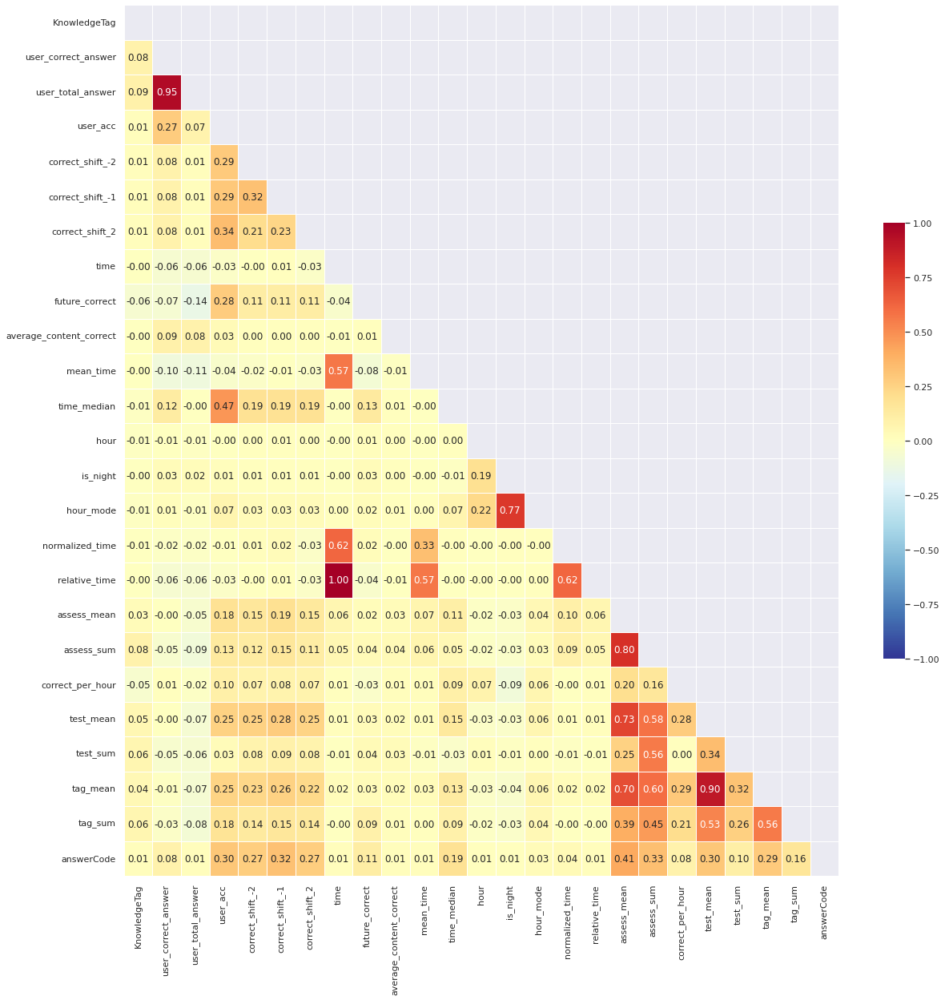
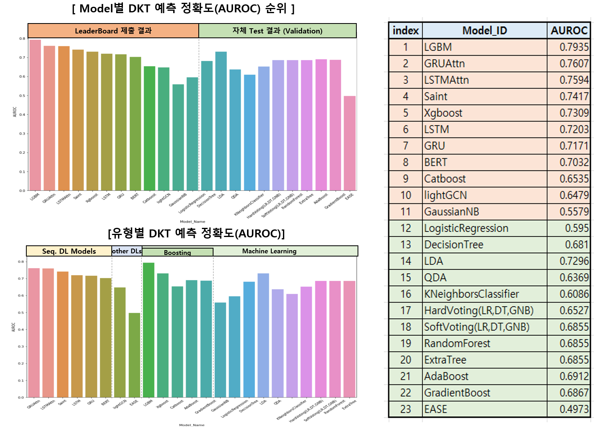
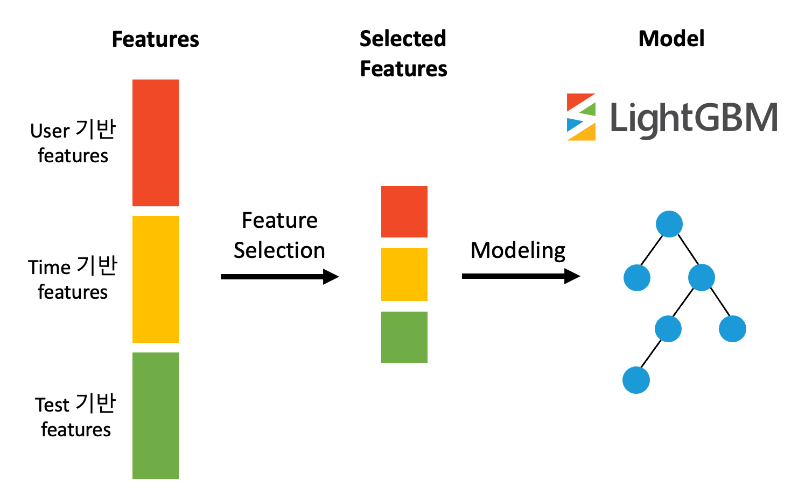

# Wrap Up report

**RecSys 3조**

강영석, 김수희, 김예지, 이현우, 홍수연

</br>

## 1. **프로젝트 개요**

| 프로젝트 주제 | 개인 맞춤화 교육을 위한 지식 상태 추적 방법론인 DKT(Deep Knowledge Tracing)를 적용하여 학생별 정답 여부를 예측해봅니다. |
| :--- | :--- |
| 프로젝트 개요 | 학생 개개인이 푼 문제 리스트와 정답 여부, 시험지 정보 등의 데이터를 입력하여 최종 문제에 대한 정답 여부를 예측하기 위한 이진 분류 DKT 모델을 구축합니다. 모델의 성능 평가 지표로는 AUROC와 Accuracy를 적용합니다. |

### 개발환경

```markdown
- IDE : VSCode
- 협업 Tool : GitHub, Slack, Notion
- Library : pytorch, pandas, recbole, sklearn, lightGBM, catboost, xgboost, torch_geometric 
- Server : 개인별 V100 서버 1개, Ubuntu 18.04 
```

### **프로젝트 및 데이터 셋 구조도**

```markdown
📦level2-dkt-level2-recsys-03
 ┣ 📂dkt
 ┃ ┣ 📂dkt
 ┃ ┃ ┣ 📜criterion.py
 ┃ ┃ ┣ 📜dataloader.py
 ┃ ┃ ┣ 📜feature_engineering.py
 ┃ ┃ ┣ 📜metric.py
 ┃ ┃ ┣ 📜model.py
 ┃ ┃ ┣ 📜optimizer.py
 ┃ ┃ ┣ 📜scheduler.py
 ┃ ┃ ┣ 📜trainer.py
 ┃ ┃ ┗ 📜utils.py
 ┃ ┣ 📜args.py
 ┃ ┣ 📜inference.py
 ┃ ┣ 📜README.md
 ┃ ┣ 📜requirements.txt
 ┃ ┗ 📜train.py
 ┣ 📂lightgcn
 ┃ ┣ 📂lightgcn
 ┣ 📂ml
 ┃ ┣ 📜Catboost.ipynb
 ┃ ┣ 📜feature_engineering.py
 ┃ ┣ 📜LGBM.ipynb
 ┃ ┣ 📜ML_models.ipynb
 ┃ ┣ 📜util.py
 ┃ ┗ 📜XGboost.ipynb
 ┣ 📂recbole
 ┃ ┗ 📜EASE Model (RecBole).ipynb
 ┣ 📜.gitignore
 ┗ 📜EDA.ipynb
```

</br>

## 2. 프로젝트 팀 구성 및 역할

- **강영석** : LightGCN, EASE, Recbole inference
- **김수희** : Saint, lgbm, lstm,lstm+attention, gru+attention, lastquery
- **김예지** : EDA, feature engineering, ML algorithm, sequential model
- **이현우 :** GRU, GRU+Attention, LSTM, LSTM+Attention, LightGCN
- **홍수연** : LGBM, LSTM, LSTM+Attention

</br>

## 3. 프로젝트 수행 절차 및 방법

|Name|Date|
|:----|:----|
|EDA|2022.04.18 ~ 2022.04.21|
|Baseline test|2022.04.20 ~ 2022.04.26|
|Feature Engineering|2022.04.23 ~ 2022.05.12|
|Model Test|2022.04.26 ~ 2022.05.12|

</br>

## 4. 프로젝트 수행 결과

</br>

### **- EDA**

 

- **Feature engineering**
    - **User 기반 features** : user마다 시간순으로 정답 수, 문제 풀이 수, 정답률을 계산하여 feature를 추가했습니다.
    - **Time 기반 features** : 미래나 과거의 정답유무나 정답률, 문제풀이시간, 문제풀이 시간대 등 time을 기반으로 feature를 추가했습니다.
    - **Test 기반 features** : 문제를 기반으로 문제풀이수, 문제풀이시간 등을 활용하여 feature를 추가했습니다.
- **Feature selection**
    - 무분별하게 feature를 많이 생성한 경우 overfitting이 발생하여 feature selection을 했습니다.
    - 다른 feature간의 correlation이 높은 경우, target과의 correlation이 낮은 경우, feature importance가 낮은 feature는 제거하였습니다.

</br>

### **- Model**

- **Machine Learning Model**
    - LGBM : 수직적으로 확장하는 leaf-wise Tree 구조의 Gradient boosting 기법입니다.
    - Catboost : Ordered Boosting 방식과 Level-wise Tree 구조의 Gradient boosting 기법입니다.
    - Xgboost : CART 모델과 Greedy 알고리즘을 사용한 Gradient boosting 기법입니다.
- **Sequential Model**
    - LSTM : RNN에 Gate를 적용하여 Long/Short term Sequential 정보를 학습하는 모델입니다.
    - LSTM +Attention :  LSTM에 Attention Layer를 추가하여 효율적으로 가중치를 학습한 모델입니다.
    - GRU: LSTM의 gate 수를 2개로 줄이고 cell state와 hidden state를 통합하여 간소화한 모델
    - GRU + Attention: LSTM을 간소화한 GRU 모델에 Attention Layer를 추가한 모델입니다.
    - BERT : Bi-directional Encoder를 갖춘 Transformer 기반 모델입니다.
    - Saint : Knowledge Tracing에서 보다 복잡한 관계를 포착하고자 새로운 Query, Key, Value의 배치를 제안한 transformer 기반 모델입니다.
- **Graph Model**
    - LightGCN : GCN의 feature transformation 과 non-linear activation을 제거한 모델입니다.

기타 Lastquery, EASE, Machine Learning model를 적용했습니다.

</br>

### **- Test & Evaluation**
<p align="center">

<p>

- 다양한 Model을 test한 결과, LGBM에 17개의 선별된 feature를 적용한 모델이 AUROC 기준 0.7935으로 가장 좋은 성능을 보여주었습니다.
- 유형별로 AUROC 결과를 분석해보면, Sequential 계열의 Deep Learning 모델은 AUROC = 0.7 이상의 성능을 보여주었으며, Attention을 추가하면 AUROC = 0.75 이상으로 성능이 향상되 었습니다.
- Boosting 계열은 적용 feature와 parameter 설정에 따라 성능이 달라졌으며, 전반적으로 0.65 이상의 AUROC 를 보여주었습니다.

</br>

### **- 최종 모델 선정 및 분석**

**Architecture : LightGBM** 

Leaderboard Score : 0.7935(public) → 0.7802(private)

Hyperparameter : metric=binary_logloss, learning_rate=0.01, boosting=dart, epoch=1000

- EDA 수행 후 Feature engineering을 접목하여 user, time, test(tag, problem) 기반으로 accuracy를 비교 분석하였습니다.
- 많은 feature로 인한 overfitting을 줄이기 위해 feature간의 correlation과 feature importance를 활용하여 이론적으로 feature selection을 실행했습니다. 그 이후 다양한 실험을 통해서 feature selection을 시도했습니다. (최종 features 수 = 17개)
- Tree 기반 모델 중에서 gradient descent를 적용하여 정확도 개선에 초점을 두고, 빠른 모델링 훈련속도를 갖춰 다양한 feature를 접목하는 실험이 가능한 LightGBM을 선정했습니다.

<p align="center">

<p>

### **- Reference**

- RecBole ([https://recbole.io/](https://recbole.io/)), Scikit-learn[(https://scikit-learn.org/stable/](https://scikit-learn.org/stable/)), LightGBM([https://lightgbm.readthedocs.io/en/latest/](https://lightgbm.readthedocs.io/en/latest/)), Xgboost([https://xgboost.readthedocs.io/en/stable/index.html](https://xgboost.readthedocs.io/en/stable/index.html)), Catboost([https://catboost.ai/](https://catboost.ai/)), Torch_geometric([https://pytorch-geometric.readthedocs.io](https://pytorch-geometric.readthedocs.io/en/latest/))
